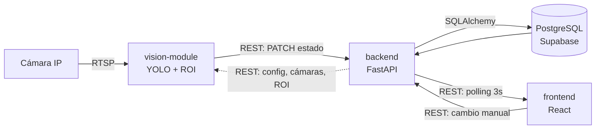

# Arquitectura de TableTracker

> Mapa general del sistema para repasar rápido. No reemplaza al anteproyecto de tesis
> (que cubre el problema, los requerimientos y la justificación): esto es **cómo está
> armado el software**, dónde vive cada cosa y cómo se conectan las piezas.

---

## 1. Qué es TableTracker, en una pantalla

TableTracker monitorea el estado de las mesas de un local gastronómico usando cámaras
de seguridad y detección de personas. Una cámara mira el salón, un módulo de visión
detecta gente sobre cada mesa y actualiza su estado (libre, ocupada, pendiente de
limpieza, reservada), y el personal ve el salón completo en una pantalla web que
también les permite cambiar estados a mano.

Son **cuatro piezas**: un **frontend** web (React) donde se ve y opera el salón; un
**backend** (FastAPI) que expone la API REST y concentra toda la lógica; un
**vision-module** (Python + YOLO) que mira el video y reporta cambios; y una **base de
datos** PostgreSQL en Supabase donde queda todo guardado. Las tres primeras son procesos
separados que se hablan solo por HTTP.

---

## 2. Flujo general



La flecha punteada es lo que el vision-module **lee** del backend al arrancar y cada
tanto: qué cámara mirar, qué polígono corresponde a cada mesa, y con qué umbrales
trabajar. Nada de eso está hardcodeado en el módulo.

**Regla de oro del diseño:** todo pasa por la API. Ni el frontend ni el vision-module
tocan la base de datos directamente.

---

## 3. Los cuatro módulos

### Backend — la API y toda la lógica

| | |
|---|---|
| **Responsabilidad** | Exponer la API REST, autenticar, aplicar permisos por rol, guardar y leer de la base, calcular métricas. |
| **Tecnología** | Python, FastAPI, SQLAlchemy, Alembic, JWT (python-jose), bcrypt |
| **Carpeta raíz** | `backend/` |
| **Archivo de entrada** | `backend/app/main.py` — se levanta con `uvicorn app.main:app` |
| **Se conecta con** | La **base** vía SQLAlchemy (`app/database.py`). Las **cámaras** por RTSP, solo para probar conexión y sacar un snapshot (`app/services/rtsp.py`). Recibe llamadas del **frontend** y del **vision-module**. |

Adentro está organizado en cuatro capas paralelas: `models/` (las 7 tablas),
`schemas/` (validación de entrada y salida con Pydantic), `routers/` (los 11 grupos de
endpoints) y `services/` (la lógica que no es ni una cosa ni la otra: cifrado, horario
de servicio, cálculo de ocupación, detección de estados dudosos, RTSP).

`main.py` **no crea las tablas**. Antes lo hacía y era una fuente de problemas: creaba
las que faltaban pero nunca modificaba las existentes, así que un entorno nuevo y
producción terminaban con esquemas distintos sin que nadie se enterara. Hoy el esquema
lo gobierna Alembic.

### Frontend — la pantalla del salón

| | |
|---|---|
| **Responsabilidad** | Mostrar el salón en vivo, permitir cambios manuales de estado, administrar mesas/sectores/cámaras/usuarios, mostrar métricas y el historial. |
| **Tecnología** | React 19, TypeScript, Vite, React Router, axios, Tailwind |
| **Carpeta raíz** | `frontend/` |
| **Archivo de entrada** | `frontend/src/main.tsx` → `frontend/src/App.tsx` |
| **Se conecta con** | Solo el **backend**, por REST. Todas las llamadas salen de un único archivo: `src/services/api.ts`. |

`App.tsx` arma el árbol: router → pantalla de error de último recurso → contexto de
sesión → las 11 rutas. `PrivateRoute` exige estar logueado; `AdminRoute` además exige
rol admin y envuelve las cuatro pantallas de administración (configuración, calibración
de ROI, cámaras, usuarios).

El cliente HTTP tiene dos automatismos que conviene tener presentes: mete el token JWT
en cada request, y ante un 401 que no venga del login borra la sesión y manda a
`/login`. Es decir, la expiración de sesión se maneja en un solo lugar.

### Vision-module — el que mira

| | |
|---|---|
| **Responsabilidad** | Leer el video, detectar personas, decidir qué mesa está ocupada y avisarle al backend. |
| **Tecnología** | Python, YOLOv8 (ultralytics), OpenCV, requests |
| **Carpeta raíz** | `vision-module/` |
| **Archivo de entrada** | `vision-module/app/main.py` (`run()` arranca, `bucle()` es el loop) |
| **Se conecta con** | La **cámara** por RTSP (OpenCV). El **backend** por REST, con su propio usuario y contraseña (`app/client/backend_client.py`). |

El pipeline tiene cuatro etapas, una carpeta cada una: `capture/` (leer el frame),
`detection/` (YOLO devuelve cajas de personas), `mapping/` (cruzar esas cajas contra los
polígonos de las mesas, sostener la observación en el tiempo y decidir el estado) y
`client/` (hablarle al backend).

Dentro de `mapping/` hay tres responsabilidades separadas a propósito: `zonas.py`
calcula cuánto se superpone una persona detectada con el polígono de una mesa,
`confirmacion.py` exige que eso se sostenga varios segundos antes de darlo por bueno, y
`politica.py` decide qué estado escribir según el estado actual de la mesa.

Al arrancar valida que el `.env` esté completo y que el sector piloto exista en el
backend; si algo falta, corta con un mensaje claro en vez de un traceback.

### Base de datos — la memoria del sistema

| | |
|---|---|
| **Responsabilidad** | Guardar mesas, sectores, cámaras, ROIs, usuarios, configuración y el historial completo de cambios de estado. |
| **Tecnología** | PostgreSQL alojado en Supabase; migraciones con Alembic |
| **Carpeta raíz** | `database/` (las migraciones; los modelos viven en `backend/app/models/`) |
| **Archivo de entrada** | `alembic -c database/alembic.ini upgrade head` |
| **Se conecta con** | Solo el **backend**. |

**Siete tablas:**

```
sectores ──< mesas ──< historial_estados
    │          │
    │          └──< roi_mesa >── camaras
    └──< camaras

users                    (independiente)
configuracion_general    (una sola fila, id = 1)
```

- **sectores** — zonas del salón, con su posición y tamaño en el canvas.
- **mesas** — número, sector, estado actual, desde cuándo, y su posición en el canvas.
- **historial_estados** — un registro por cambio, con `origen_cambio` que distingue si
  lo hizo una persona o la detección automática. Guarda **eventos**, no rangos: cuánto
  duró un estado se deduce de la hora del registro siguiente de esa mesa.
- **camaras** — datos de conexión desglosados (host, puerto, ruta, usuario) y la
  contraseña cifrada.
- **roi_mesa** — la tabla puente entre mesa y cámara: guarda el polígono (la "región de
  interés") que define dónde está esa mesa en la imagen de esa cámara.
- **users** — nombre, email, contraseña hasheada y rol.
- **configuracion_general** — fila única con el tamaño del salón, el horario de
  servicio y los umbrales de detección.

La conexión usa el pooler de Supabase, que cierra las conexiones ociosas a los 5
minutos; por eso el motor está configurado para reciclarlas antes de que eso pase y
para verificarlas antes de usarlas.

---

## 4. Dos flujos de ejemplo

### (a) Detección automática: alguien se sienta en una mesa

1. El vision-module lee un frame del stream RTSP de la cámara (uno cada 2 segundos, no
   30 por segundo: no hace falta más y deja presupuesto de cómputo de sobra).
2. YOLO detecta las personas en ese frame y devuelve una caja por cada una.
3. Cada caja se cruza contra los polígonos de las mesas: si se superpone lo suficiente
   con el ROI de la mesa 5, se considera que hay gente en la mesa 5.
4. Esa observación **no se aplica todavía**. El confirmador exige que se sostenga varios
   segundos seguidos, para que alguien que pasa caminando no ocupe la mesa.
5. Confirmada la ocupación, el módulo relee el estado actual de la mesa
   (`GET /mesas/5`) — pudo haberla tocado un mozo en el medio — y la política decide:
   si estaba libre o reservada, pasa a ocupada; si ya estaba ocupada, no hace nada.
6. Si hay algo que escribir, manda `PATCH /mesas/5/estado`. Esto corre en un hilo aparte
   para no frenar el procesamiento del próximo frame.
7. El backend cambia el estado, escribe el registro en el historial marcado como
   **automático** (porque el usuario que llamó tiene rol `vision_module`) y actualiza
   el reloj de "en este estado desde".
8. En el próximo refresco (máximo 3 segundos después) el frontend pide `GET /mesas/` y
   la mesa 5 aparece en rojo en el salón.

Si el backend falla en el paso 6, el módulo **olvida la confirmación** para que el
próximo frame la vuelva a confirmar y reintente. Si no hiciera eso, la mesa quedaría
desincronizada hasta que la ocupación cambiara de nuevo.

### (b) Cambio manual: un mozo marca una mesa como limpia

1. El mozo está viendo el salón en el Dashboard y hace clic en una mesa naranja
   (pendiente de limpieza).
2. Se abre el panel de la mesa. Qué botones ve depende de su rol: `permisos.ts` cruza el
   rol que expone el contexto de sesión con cada acción.
3. Toca "marcar como limpia". El frontend llama a `PATCH /mesas/{id}/limpieza` a través
   de `api.ts`, que le agrega el token JWT automáticamente.
4. El backend valida el token, resuelve qué usuario es y verifica que su rol esté
   autorizado para ese endpoint.
5. Cambia el estado de la mesa, escribe el registro en el historial marcado como
   **manual** (cualquier rol que no sea `vision_module` cuenta como persona operando) y
   mueve el reloj de "en este estado desde".
6. El frontend actualiza la mesa en pantalla y, en el siguiente ciclo de refresco, todas
   las demás pantallas abiertas ven el cambio también.

El vision-module no pisa esto: en el paso 5 del flujo (a) siempre relee el estado real
antes de escribir, así que respeta lo que haya hecho una persona.

---

## 5. Dónde vive cada cosa

| Qué | Dónde |
|---|---|
| Código del backend | `backend/app/` — `models/`, `schemas/`, `routers/`, `services/` |
| Código del frontend | `frontend/src/` — `pages/`, `components/`, `hooks/`, `services/api.ts` |
| Código del vision-module | `vision-module/app/` — `capture/`, `detection/`, `mapping/`, `client/` |
| Modelos de las tablas | `backend/app/models/` (uno por tabla) |
| Migraciones | `database/versions/` (9 revisiones) — se aplican con `alembic -c database/alembic.ini upgrade head` |
| Migraciones viejas, previas a Alembic | `database/historico/` |
| Modelos YOLO entrenados | `vision-module/models/` (`yolov8n/s/m.pt`) |
| Config del backend | `backend/.env` — base de datos, clave de firma JWT, clave de cifrado de cámaras, orígenes CORS |
| Config del frontend | `frontend/.env` — solo la URL de la API |
| Config del vision-module | `vision-module/.env` — credenciales del backend, sector y cámara, contraseña RTSP, parámetros de YOLO y del pipeline |
| Config de los tests e2e | `e2e/.env` — usuario de prueba |
| Tests del backend | `backend/tests/` (13 archivos, pytest) |
| Tests del vision-module | `vision-module/tests/` (8 archivos, pytest) |
| Tests end-to-end | `e2e/tests/` (24 specs, Playwright) — levanta frontend y backend solo |
| Scripts operativos | `backend/scripts/` (rotar claves, verificar esquema) y `vision-module/scripts/` (benchmarks, captura de muestras) |
| Documentación | `docs/` — este archivo más las auditorías, el detalle del loop de visión, privacidad, roles y pruebas |

Los cuatro `.env` están fuera del control de versiones; cada uno tiene su `.env.example`
versionado al lado, que sirve de referencia de qué variables hacen falta.

---

## 6. Cosas a tener en cuenta

Cinco decisiones y limitaciones que no se deducen mirando el código:

- **La última detección de cada cámara se guarda en memoria del proceso, no en la base.**
  Es una decisión de privacidad deliberada, no un atajo: el sistema no almacena imágenes
  ni historial de detecciones, solo el último resultado, y se pierde al reiniciar. La
  contrapartida es que el backend **asume un solo worker**: con varios procesos, cada uno
  tendría su propia copia y la vista en vivo podría mostrar un dato viejo.

- **El vision-module cubre un sector y una cámara por proceso.** Es el alcance de sector
  piloto que se definió para el trabajo. Escalar a un salón entero significa levantar
  varias instancias del módulo, una por cámara — la arquitectura lo permite (cada una
  descubre su configuración del backend), pero no está probado a esa escala.

- **No hay tiempo real: el salón se actualiza por consulta periódica cada 3 segundos.**
  Se eligió polling sobre WebSockets por simplicidad. El costo es que un cambio puede
  tardar hasta 3 segundos en verse, y que cada pantalla abierta genera tráfico constante
  contra la API.

- **La contraseña de la cámara está en dos lugares distintos, a propósito.** En la base
  está cifrada (para que un volcado de la tabla o el panel de Supabase no entreguen el
  acceso al video), y la API la devuelve siempre enmascarada. Como el vision-module
  necesita la contraseña real para abrir el stream, la tiene en su propio `.env`. Es un
  compromiso consciente: proteger la base costó duplicar el secreto.

- **Los permisos por rol no son uniformes entre endpoints equivalentes.** Hay operaciones
  parecidas que exigen roles distintos, y está relevado y documentado en
  `docs/auditoria-codigo.md` y `docs/roles-permisos.md`, pero unificarlo quedó fuera del
  alcance del sprint. En la misma línea: el endpoint que cambia el estado de una mesa no
  verifica que la mesa siga activa, así que una mesa dada de baja mientras el sistema
  corre puede seguir recibiendo cambios hasta el siguiente refresco del módulo de visión.
